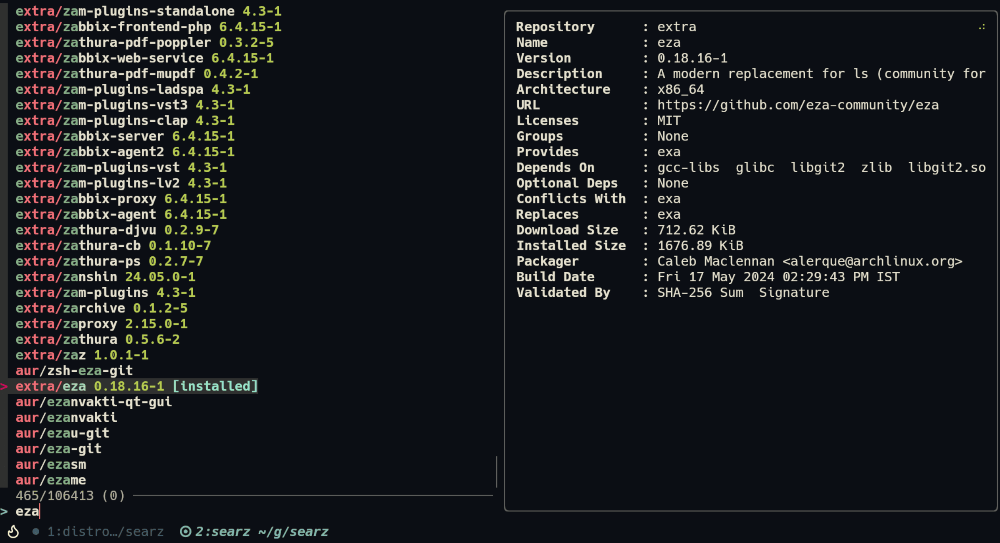

# Searz



Searz is an OS-agnostic package fuzzy finder i.e it provides a fuzzy finder interface for various package managers across different Linux distributions. It allows users to easily search, preview, and manage packages from the command line.

## Features

- Supports multiple package managers: `pacman`, `paru`, `yay`, `dnf`, `yum`, and `apt`
- Uses `fzf` for a powerful and intuitive fuzzy finder interface
- Allows selection and deselection of multiple packages
- Automatically invokes `sudo` when necessary

## Requirements

- `fzf`
- `bash` > 4.3

## Installation

```shell
curl -o ~/.local/bin/searz https://raw.githubusercontent.com/vyogami/searz/main/searz
chmod +x ~/.local/bin/searz
```

## Usage

Simply run the `searz` with the desired options. If no options are specified, it defaults to the `install` command for the detected package manager.

```sh
searz [OPTIONS]
```

### Examples

- Firing up the `fzf` interface:

  ```sh
  searz
  ```

- Using a specific package manager (`yay` in this case):

  ```sh
  PKG_CMD=yay searz
  ```

## Keybindings

- `TAB`: Select
- `Shift+TAB`: Deselect

## Help

To see the help message, use:

```sh
searz -h
```

## Contributing

Contributions are welcome! Please open an issue or submit a pull request on GitHub.

## License

This project is licensed under the MIT License. See the [LICENSE](LICENSE) file for details.
